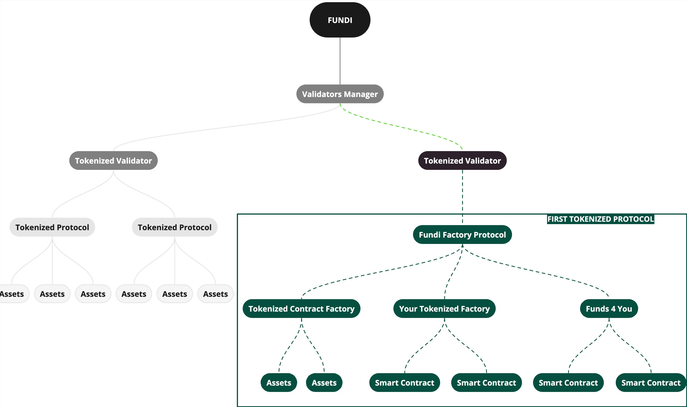

> **IMPORTANT:** \_This repo is a work in progress, and contracts have not been audited and only accessible on Ethereum/Base Sepolia until completed audit and mainnet deployment. Use with your own risk

# Fundi Factory Overview

# Table of Contents

- [Fundi Overview](#fundi-overview)
- [The example in this repo](#the-example-in-this-repo)
  - [ExampleFundiFactory.sol](#ExampleFundiFactory)
  - [ExampleFundiAsset.sol](#ExampleFundiAsset)
- [Getting Started](#getting-started)
  - [Requirements](#requirements)
  - [Installation](#installation)
  - [Build] (#build)
  - [Test] (#test)
  - [Deploy] (#deploy)
- [Chainlink](#chainlnk)
- [Openzeppellin](#openzeppelin)
- [What does this unlock?](#what-does-this-unlock)
- [Disclaimer](#disclaimer)

# Fundi Overview

<br/>
<p align="center">

</p>
<br/>

Fundi is an open verifiable network of digital keys that tokenize validators and protocols to mint smart contracts and assets. These customizable contract keys adhere to a new NFT standard designed to facilitate seamless ownership transfer, making them verifiable by Fundi users and incentivized for security.

This repository utilizes the Fundi Factory Protocol, a protocol that tokenizes smart contract factories and can be monetized with any ERC20 cryptocurrency for minting contracts and assets. 100% of the proceeds are claimable by the owner.

Check out Fundi Tokenized Factories at [Opensea](https://testnets.opensea.io/collection/fundi-factory-protocol-sepolia-1) on Base Sepolia

Interact with protocol functions at : [Etherscan](https://sepolia.basescan.org/address/0x691692b88f79fada53a6f41ac2628c5f7ab2d344)

<details>

# The example in this repo

In this repo, we will go over how to tokenize a smart contract factory.

1. Example Fundi Asset, smart contract that factory should mint and tokenize: `ExampleFundiAsset.sol`
2. Example Fundi Factory, factory that mints and tokenizes asset using Fundi `ExampleFundiFactory.sol`

The idea here, is that once you see the power of this example, you should be able to tokenize anything.

## ExampleFundiAsset.sol

1. This is the smart contract that is tokenized. It could be anything or use case that you can think of 😉
2. This contract inherits the `FundiAsset.sol` implementation which allows it to be tokenized by a `FundiFactory.sol` on the Fundi Factory Protocol

For `ExampleFundiAsset.sol` we are tokenizing a contract that can accept native and ERC-20 cryptocurrencies and only the owner of the protocol minted key can `ownerWithdraw`

## ExampleFundiFactory.sol

1. This is the smart contract that is tokenized and also tokenizes a `FundiAsset.sol`. 😉
2. This contract inherits the `FundiFactory.sol` implementation which allows it to tokenize `FundiAsset.sol` and be tokenized on the Fundi Factory Protocol

For `ExampleFundiFactory.sol` we are tokenizing a contract factory that mints `ExampleFundiAsset.sol` contracts on Fundi. The owner of this factory key can collect mint fees through Fundi Factory Protocol `withdrawFundiProceeds` and `withdrawFundiProceeds` functions.

# Getting Started

## Requirements

- [git](https://git-scm.com/book/en/v2/Getting-Started-Installing-Git)
  - You'll know you did it right if you can run `git --version` and you see a response like `git version x.x.x`
- [foundry](https://getfoundry.sh/)
  - You'll know you did it right if you can run `forge --version` and you see a response like `forge 0.2.0 (816e00b 2023-03-16T00:05:26.396218Z)`
- [node](https://nodejs.org/en/download/)
  - You'll know you did it right if you can run `node --version` and you see a response like `v16.13.0`
- [npm](https://www.npmjs.com/get-npm)
  - You'll know you did it right if you can run `npm --version` and you see a response like `8.1.0`

## Installation

1. Clone the repo, navigate to the directory, and begin building your smart contract factory with the same implementations as `src/Factories/ExampleFundiFactory.sol` and `src/Assets/ExampleFundiAsset.sol`

```
git clone https://github.com/fundiprotocol/FundiFactoryFoundryKit
cd FundiFactoryFoundryKit

```

## Build

1. Using `ExampleFundiAsset.sol` as a template create your own custom smart contract using Chainlink and Openzeppelin in `lib`
2. Use function modifier `onlyOwner` to only give access to token holder
3. Using `ExampleFundiFactory.sol` as a template
4. There are 7 types of `FundiAsset.sol` you can specify: PAYROLL(blue), TRUST(red), ESCROW(yellow), CROWDFUND(green), PERSONAL_ACCOUNT(purple), CONTRACT(red), and CUSTOM(white)

## Test

1. Build test for your factory and the asset that it mints to ensure that your contracts work as expected
2. You can upload audits to your contracts using `addContractAudit(string memory auditReport)` if you want to be verified by Fundi Governance

## Deploy

1. Write deployment script using `script/DeployFundiFactory.s.sol` as an example.
2. This script deploys the Factory and then mints a key that tokenizes the factory on Fundi Factory Protocol.
3. Update your Factory type, contractURI, and required fee in `fundiProtocol.mintFactoryKey(
    address(exampleFactory), <-address of deployed factory
    IFundiProtocol.AssetType.CUSTOM, <-custom factory
    "FactoryContractURI", <-factory contract info
    address(fundiToken), <-fundi token
    0 <-no fee
)`
4. Test deployment using `forge script scripts/DeployFundiFactory.s.sol --rpc-url YOUR_RPC_URL`
5. View your Factory on NFT Marketplaces at the Fundi Factory Protocol address

# Chainlink

This repository includes Chainlink contracts, which expand the capabilities of smart contracts by enabling access to real-world data and off-chain computation while maintaining the security and reliability guarantees inherent to blockchain technology

Products

- CCIP - enables cross-chain functionality to contracts
- Functions - enables off chain api calls through Chainlink nodes
- Automation - automate functions based on set conditions
- Price feeds - get price feeds from Chainlink oracles for defi
- VRF - verifiable randomness

Go to [Chainlink Dev Hub](https://dev.chain.link/) to learn more

# Openzeppelin

This repo has Openzeppelin, a library for secure smart contract development. Build on a solid foundation of community-vetted code.

Implementations of standards like ERC20 and ERC721.
Flexible role-based permissioning scheme.
Reusable Solidity components to build custom contracts and complex decentralized systems.

Go to [Openzeppelin](https://www.openzeppelin.com/contracts) to learn more

# What does this unlock?

Being able to verify and tokenize ownership of contract factories, funds, protocols, business processes, or any smart contract 🤯

# Disclaimer

The repository has not been audited, use at your own risk.
